# Aws-Data-Portfolio

Welcome to my AWS project portfolio! This page includes all the projects I completed during my course in Cloud Computing.

---

## Academic Services Data Platform – Full AWS Pipeline (Weeks 1–7)

**Type of Analysis**: Analysis + Design + Implementation + Evaluation 
**Objective**: As a Finance data team member, I had to perform end-to-end data project involving creation, exploration, wrangling, and quality analysis of data given by the operational team.

### 🗓️ Week 1 – Business Understanding & AWS Setup

- Analyzed the business requirement and dataset description.
- Created a business questionnaire to guide the data exploration.
- Designed a **Fishbone Diagram** to visualize key factors affecting the problem.
- AWS Setup and Implementation:
  - Renamed the **VPC** and **Security Group**
  - Created and named an **EC2 instance**
  - Saved the preview code for reference
  - Created **S3 buckets**, added folders, uploaded CSV and JSON files
  - Applied **tags** for easy resource tracking
  - Terminated the EC2 instance after setup

📸 Screenshots:  
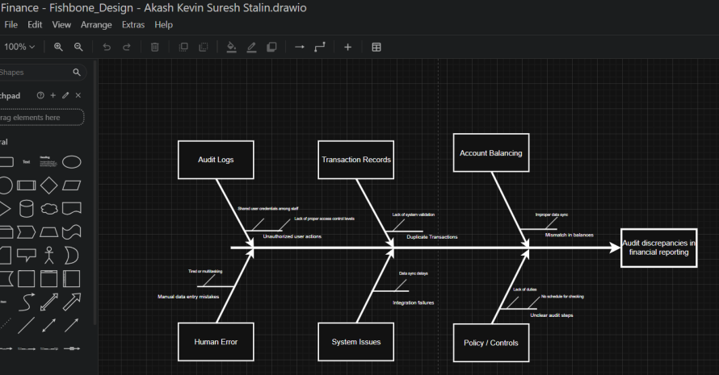  
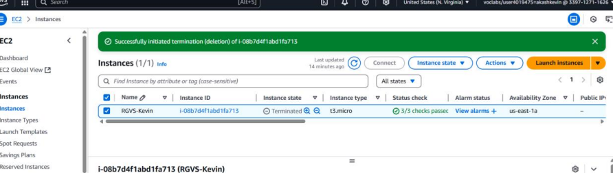

---

### 🗓️ Week 2 – Storage Analysis & Data Cleaning with AWS Glue DataBrew

- Designed, implemented, and evaluated initial data setup.
- Analyzed storage usage via **AWS Storage Lens Dashboard**.
- Estimated storage costs using the **AWS Pricing Calculator**.
- Saved analysis and results as a PDF for review.
- Started data cleaning using **AWS Glue DataBrew**:
  - Created a new S3 bucket specifically for cleaning tasks.
  - Organized bucket into `system/` and `user/` folders.
  - Created and ran a DataBrew job to clean and format data.
  - Performed manual cleaning (e.g., formatting dates) in DataBrew.

📸 Screenshots:  
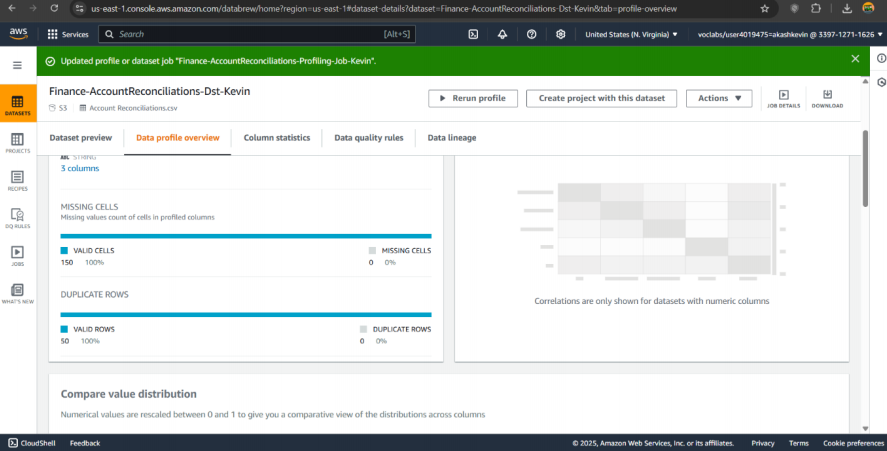  
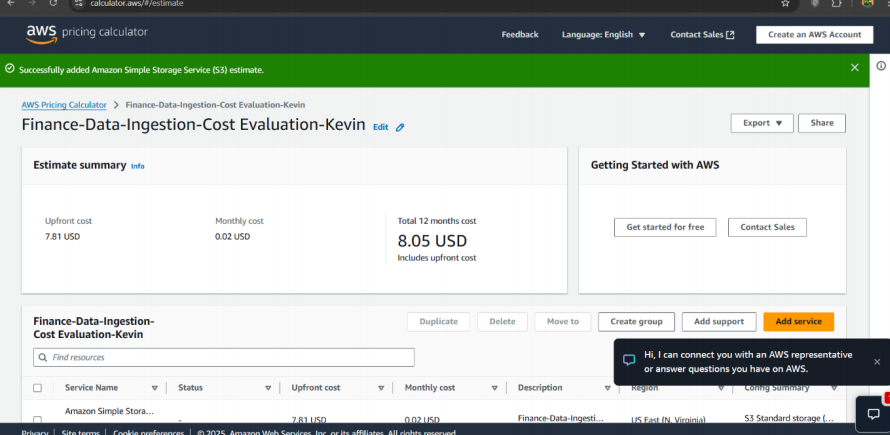  
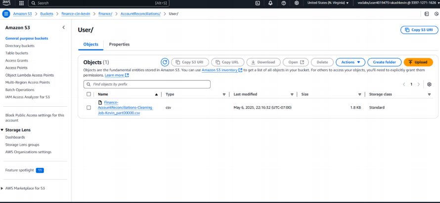  
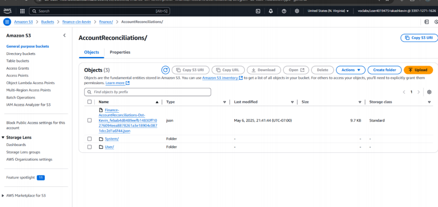

---

### 🗓️ Week 3 – Cost Profiling, Glue Catalog, and Athena Validation

- Evaluated dataset profiling and cleaning costs using **AWS Pricing Calculator**.
- Created data cleaning jobs using **AWS Glue DataBrew**.
- Updated ETL sheet with:
  - Business questions
  - Data questions
  - Metrics tracking
- Set up an **AWS CloudWatch Alarm** for monitoring cost or usage.
- Used **AWS Glue** to:
  - Create a **Data Catalog**
  - Configure and run a **Crawler**
- Completed **Visual ETL design** for data flow understanding.
- Validated data outputs using **AWS Athena** queries.

📸 Screenshots:   
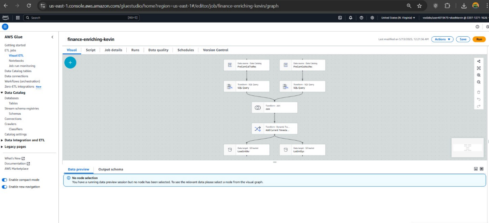  
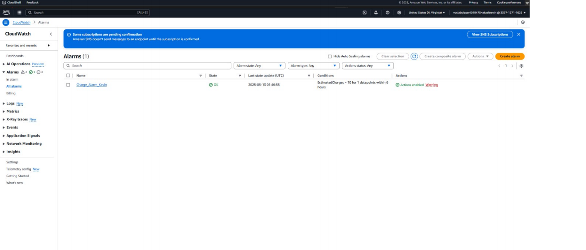  
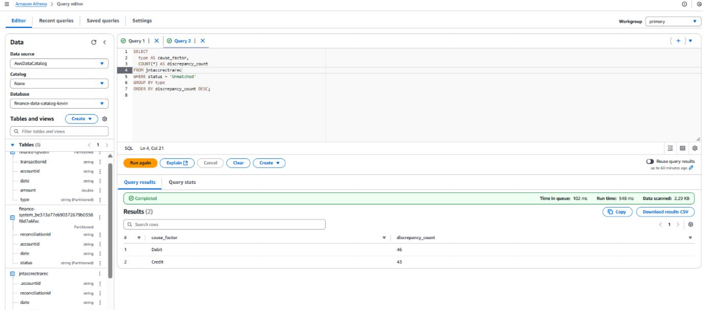

---

### 🗓️ Week 4 – Data Architecture & S3 Data Lake Setup

- Deep-dive analysis of business requirements to align the operational environment.
- Mapped **data lineage** based on business questions and provided datasets.
- Identified issues and visualized root causes using a **Fishbone Diagram**.
- Designed and implemented the **DAP solution architecture**.
- Updated the following design sheets:
  - **Data Lake Design**
  - **Data Cleaning Design**
  - **ETL Design**
- Created **3 S3 Buckets** to support data lake architecture:
  - `raw/` bucket – for untouched incoming data
  - `clean/` bucket – for processed outputs
  - `curated/` bucket – for final reports or dashboard-ready data
- Created appropriate subfolders in each bucket and uploaded CSV files.

📸 Screenshots:  
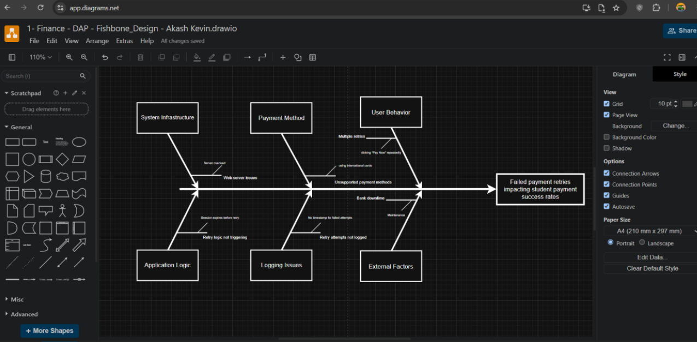  
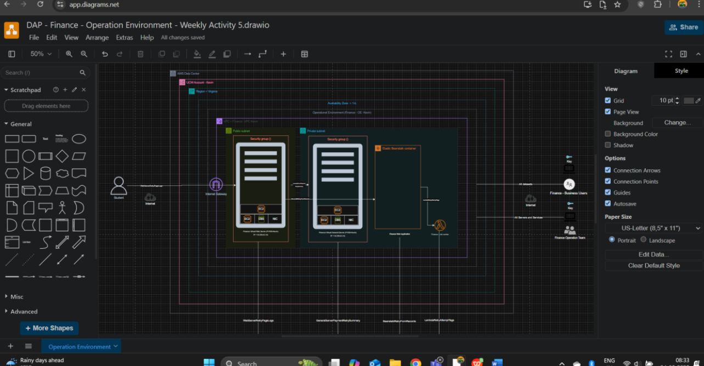  

---

### 🗓️ Week 5 – Final ETL Pipeline: Glue Job, Crawler, Athena, and Quicksight

- **AWS Glue Job**:
  - Created and configured a Glue job to transform cleaned data from S3.
  - Defined input/output paths and selected transformation logic.
  - Ran and monitored job execution to verify success.

- **Glue Crawler**:
  - Configured a Glue Crawler to automatically scan the cleaned dataset.
  - Created a new table in the Glue Data Catalog with inferred schema.

- **Athena Validation**:
  - Queried the cleaned and transformed data using **Athena**.
  - Verified output structure, row count, and key metrics.

- **Amazon QuickSight Dashboard**:
  - Connected QuickSight to Athena table.
  - Built visual dashboards to display key performance metrics.
  - Used bar charts, tables, and filters to present insights interactively.

📸 Screenshots:  
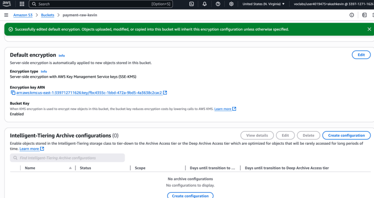    
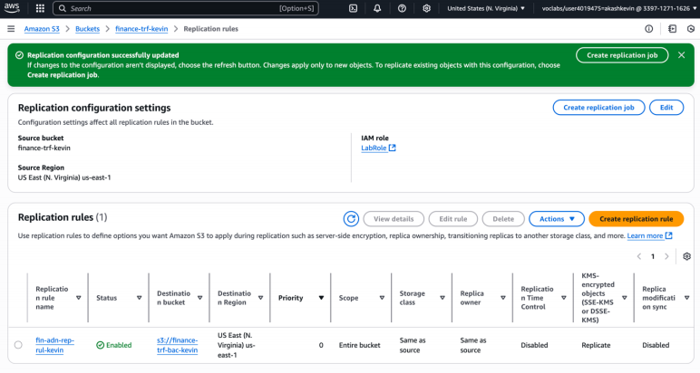

---

### 🗓️ Week 6 – Final Data Flow, Monitoring & Dashboard Refinement

- Finalized and validated the complete **ETL flow**:
  - Ensured raw → clean → curated data movement via S3 buckets.
  - Verified proper linkage between Glue Job, Crawler, and Athena Table.

- **Monitoring Setup**:
  - Checked AWS Glue job logs and metrics.
  - Used AWS CloudWatch to monitor job execution and resource consumption.

- **QuickSight Enhancements**:
  - Improved visual layout of the dashboard.
  - Added KPIs and filter controls to allow dynamic views.
  - Ensured dashboard reads from updated Athena query results.

- Ensured full alignment between data pipeline and project goals.

📸 Screenshots:  
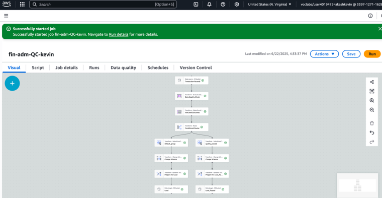  
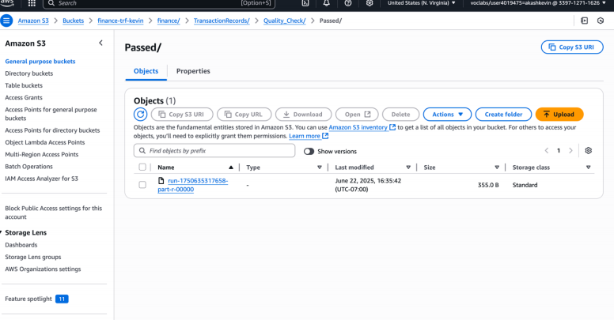  

---

### 🗓️ Week 7 – Final Review, Optimization & Reporting

- Conducted a full review of the end-to-end ETL pipeline and dashboards.
- Verified:
  - File movements between `raw`, `clean`, and `curated` S3 buckets.
  - Glue Jobs and Crawler scheduling and output accuracy.
  - Query performance in **Athena** (cost-efficient and optimized).
  - Dashboard functionality in **QuickSight** for real-time insights.

- Identified improvement opportunities:
  - Added retry logic and failover alerts in Glue job configuration.
  - Suggested periodic crawl schedule to auto-update schema.
  - Documented full project setup, roles, and services used.

- Created a final project report combining architecture, monitoring metrics, and visualization outputs.

📸 Screenshots:  
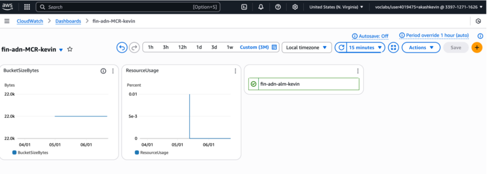  
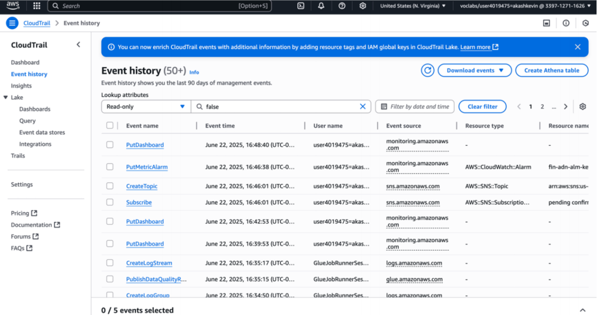  

---

## 🏙️ City of Vancouver Project – Fitness Business Licenses Data Platform

**Business Question**:  
*How has the number of new fitness business licenses changed over time in Vancouver?*

This project analyzes the monthly/yearly trend of fitness-related business licenses issued in Vancouver, identifies seasonal patterns, and highlights geographic trends.

---

### 🔁 Step-by-Step Pipeline

#### 1️⃣ Data Ingestion
- Downloaded `.csv` dataset from City of Vancouver’s Open Data Portal.
- Created an S3 bucket `fitness-raw-kevin` and uploaded the file.
- Structured folders in S3 for easy navigation.

📸 Screenshot:  
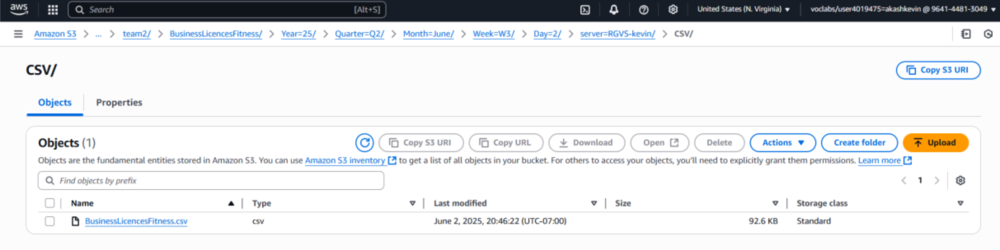

---

#### 2️⃣ Data Profiling
- Used **AWS Glue DataBrew** to analyze the dataset.
- Verified field completeness: e.g., `issue_date`, `status`, and `business_category` had over 95% filled values.
- Minor missing values in `postal_code` were noted but acceptable.

📸 Screenshot:  
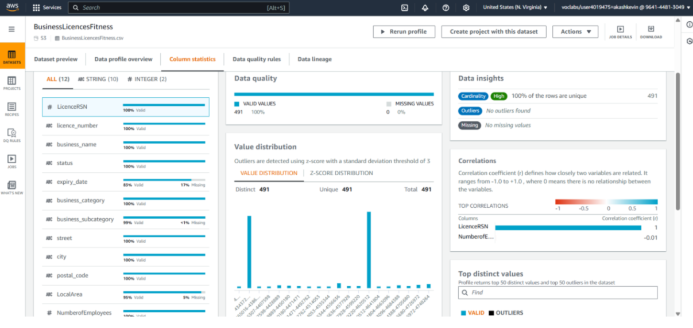

---

#### 3️⃣ Data Cleaning
- Standardized date formats across all date fields.
- Removed duplicates and missing rows.
- Uppercased all text fields for uniformity.

📸 Screenshot:  
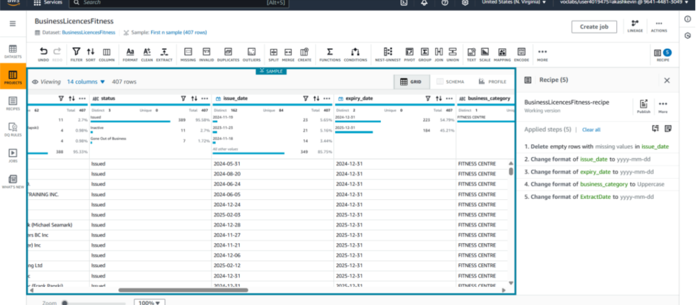

---

#### 4️⃣ Data Cataloging
- Created AWS Glue Crawler: `fitness-licences-crawler`
- Registered cleaned data into Glue Catalog under `fitness-data-catalog-kevin`.
- Verified schema with columns like `issue_date`, `status`, and `business_category`.

📸 Screenshot:  
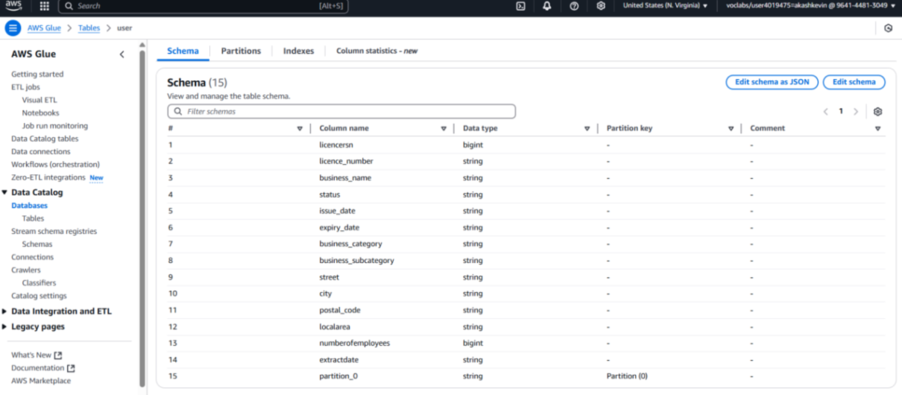

---

#### 5️⃣ Data Summarization
- Ran queries in **Amazon Athena** to extract:
  - Monthly and yearly trends in new licenses.
  - Regional license distribution by postal code.
- Exported insights into structured reports.

📸 Screenshot:  
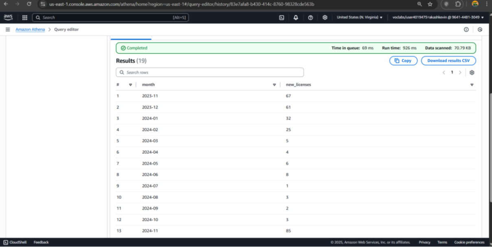

---

### 🔐 Advanced Features

#### 6️⃣ Data Security
- Enabled **Block Public Access** on S3 buckets.
- Used **SSE-S3** (Server-Side Encryption) for secure data storage.

📸 Screenshot:  
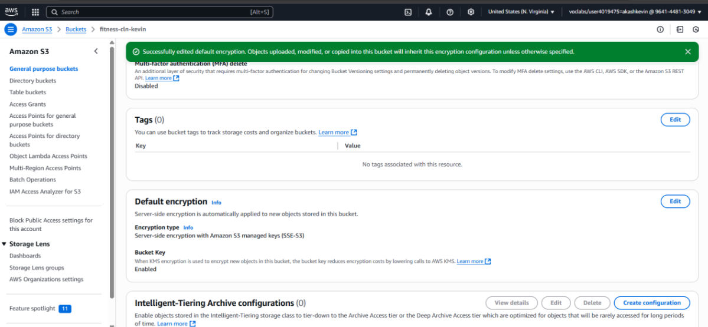

---

#### 7️⃣ Data Governance
- Maintained naming standards in Glue Catalog for clarity.
- Ensured columns and datatypes were auto-detected and verified.

📸 Screenshot:  
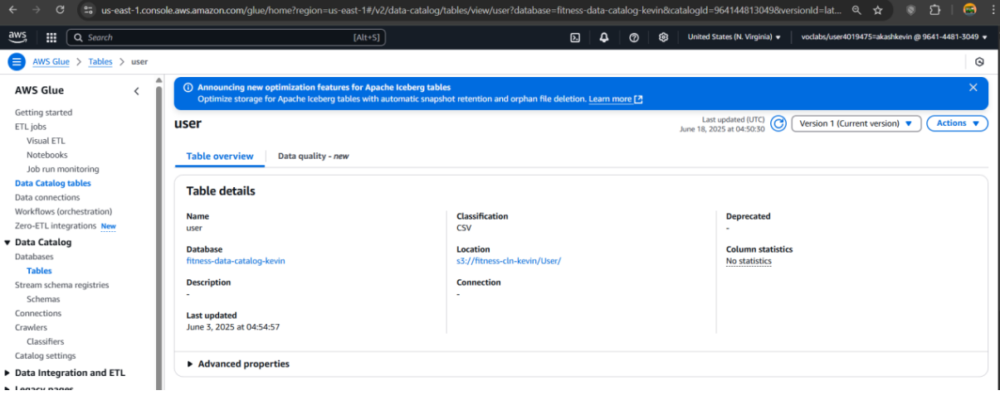

---

#### 8️⃣ Data Monitoring
- Launched Glue DataBrew job and confirmed visual **Succeeded** status.
- Attempted to access **CloudWatch** and **CloudTrail** for logs but access was limited due to student account.
- Still demonstrated understanding of their role in observability.

📸 Screenshot:  
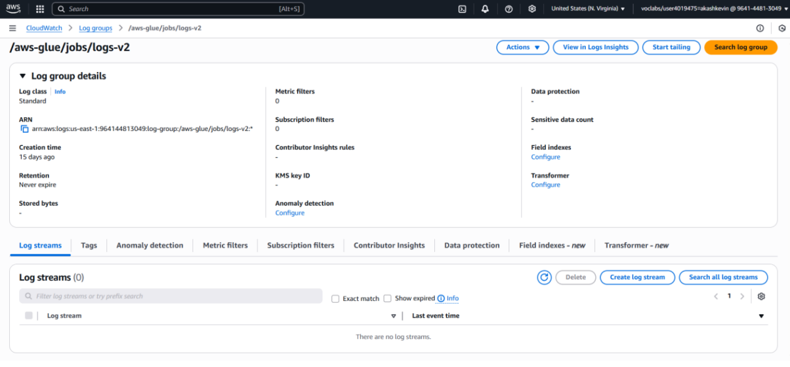

---

### 🧾 Summary

This City of Vancouver project demonstrates a complete AWS-based **Data Analytics Platform (DAP)** covering:
- Data ingestion, profiling, cleaning, cataloging, summarization
- Security, governance, and operational monitoring

The entire pipeline was executed using AWS tools like **S3**, **Glue**, **DataBrew**, **Athena**, and **QuickSight**, showing end-to-end cloud data processing capability.

---

##  AWS Architecture Learning Journey (7-Module Visual Summary)

This section showcases my progressive understanding of core AWS concepts and solutions, captured through 7 visually designed modules in Draw.io. Each module reflects a step in building cloud-native thinking and solution architecture using AWS tools.

---

### 🔹 Module 1 – IAM & Access Control

- Learned about **Identity and Access Management (IAM)**.
- Understood how to define users, groups, roles, and apply policies.
- Explored AWS best practices like least privilege and MFA.

---

### 🔹 Module 2 – Networking & VPC Design

- Designed a basic **Virtual Private Cloud (VPC)** setup.
- Configured subnets, route tables, internet gateways, and NAT.
- Understood the difference between public vs private subnets.

---

### 🔹 Module 3 – Compute & EC2 Instances

- Explored different **EC2 instance types** and pricing models.
- Designed instance placement in multiple AZs for high availability.
- Connected EC2 with security groups and SSH access.

---

### 🔹 Module 4 – Storage Options & Data Lifecycle

- Compared **S3, EBS, and EFS** for different use cases.
- Understood storage classes and cost optimization via **S3 lifecycle policies**.
- Learned how to integrate storage with compute resources.

---

### 🔹 Module 5 – Database & Data Services

- Designed architectures involving **RDS**, **DynamoDB**, and **Aurora**.
- Understood use cases for relational vs NoSQL models.
- Considered availability, backup, and scaling strategies.

---

### 🔹 Module 6 – Monitoring & Cost Estimation

- Practiced using **CloudWatch** and **Billing Dashboard**.
- Set up alarms and estimated costs via **AWS Pricing Calculator**.
- Learned to track service usage and optimize billing.

---

### 🔹 Module 7 – Security, Governance & Disaster Recovery

- Applied **encryption options** (SSE, KMS).
- Reviewed compliance, tagging, and governance tools.
- Designed DR architecture with cross-region backup and failover strategies.

---

📁 Source Files:
- [`aws-part1.drawio`](designs/AWS Assignment Part 1 - Akash Kevin - V03.drawio)
- [`aws-part2.drawio`](designs/AWS Assignment - Part 2 .drawio)

All modules are available as visual diagrams in my GitHub repo’s `/designs` and `/images` folders.

## 🔗 Portfolio Website

This portfolio is hosted on **GitHub Pages**. Link will be added here once activated.

